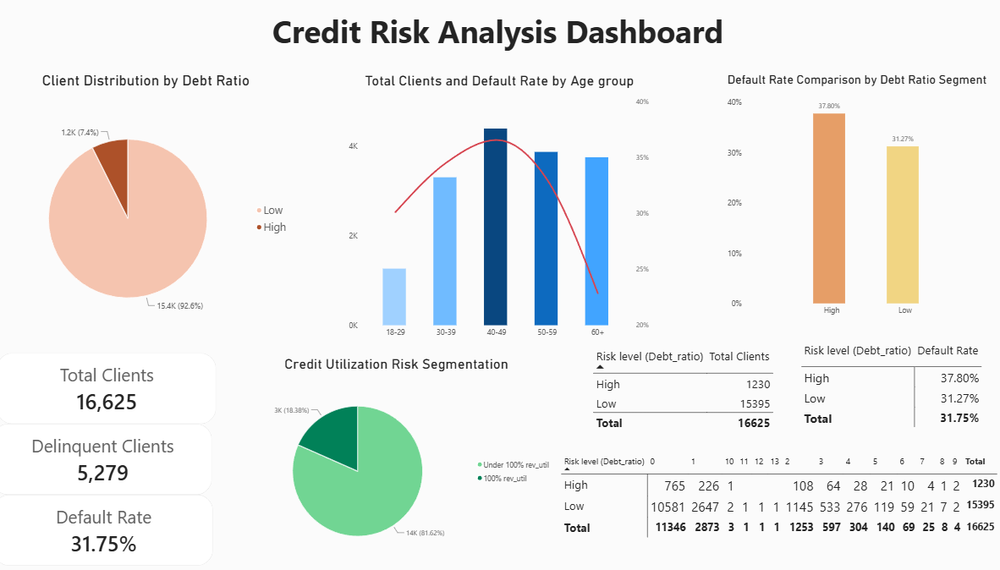

# Credit-Risk-Analysis
Comprehensive Credit Risk and Default Rate Analysis using Excel and MySQL. Dashboard created using Power BI.

# Credit Risk & Default Rate Analysis



## Project Overview
This project performs a comprehensive Credit Risk Analysis on a dataset of **16,625 credit clients**. The main objective is to evaluate key risk drivers such as credit utilization, debt-to-income ratio, age demographics, and delinquency history using **MySQL** and **Excel**.

---

## Tech Stack & Tools Used
* **SQL (MySQL WorkBench):** Complex aggregation, Subquieries, Window Functions. 
* **Data Processing:** MySQL Data Import Wizard, Data Type Transformations.
* **Excel:** Pivot Tables, Dynamic KPI Cards, Cross-Tabulations.

---

## Key Findings & Executive Insights

### 1. High Credit Utilization Risk
* **18.38%** of total clients (3,056 clients) have fully maxed out their credit limit (>= 99.5\% utilization).
* High utilization serves as a strong early indicator of liquidity stress.

### 2. Debt Ratio vs. Severe Delinquency
* Clients with a **Debt Ratio >= 1.0** show a **37.80% default rate**, compared to **31.27%** in the low-debt segment (+6.53 percentage points).
* Chronic default risk (3+ late payments) is **1.6x higher** in high-debt clients.

### 3. Age Demographics
* **Peak Default Risk:** Age group **40–49** exhibits the highest default rate (**36.59%**), followed by **30–39** (**34.54%**).
* **Lowest Risk:** Senior borrowers (**60+**) have the lowest default rate (**22.87%**).

---

##  Project Repository Structure
```text
├── credit_risk_analysis.sql      # Full MySQL scripts (Aggregations, Subquieries, Window Functions)
├── Credit_Risk_Benchmark.xlsx   # Excel workbook with Pivot Tables & KPI Summaries
└── README.md                    # Project documentation
